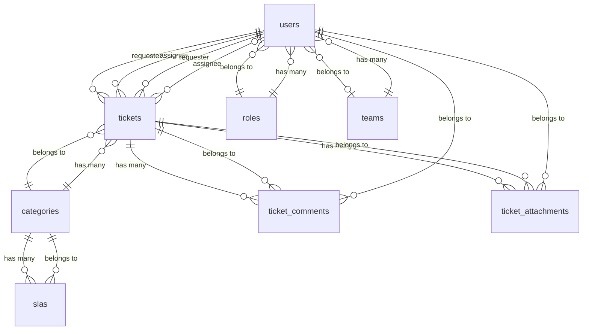

# Printbag - Sistema de Chamados

Sistema de help desk interno da Printbag Embalagens desenvolvido em Laravel 11 com Tailwind CSS para gerenciamento de chamados, SLAs e equipes.

**Desenvolvido por:** Pedro Levorato

## Ys CaracterAsticas

- **AutenticaAAo e AutorizaAAo**: Sistema de roles (Admin, Gestor, Atendente, UsuArio)
- **GestAo de Chamados**: CriaAAo, atribuiAAo, acompanhamento e resoluAAo
- **SLA Inteligente**: CAlculo automAtico de prazos baseado em categoria e prioridade
- **ComentArios**: Sistema de comentArios pAblicos e notas internas
- **Anexos**: Upload seguro de arquivos
- **Dashboard**: VisAo geral com mAtricas e chamados recentes
- **Filtros AvanAados**: Busca por status, prioridade, categoria e atribuiAAo
- **Interface Responsiva**: Design moderno com Tailwind CSS
- **API REST**: Endpoints para integraAAo com outros sistemas

## Y i Stack TAcnica

- **Backend**: Laravel 10+, PHP 8.2+
- **Frontend**: Blade + Tailwind CSS + Vite
- **Banco de Dados**: MySQL 8+ / MariaDB 10.11+
- **AutenticaAAo**: Laravel Breeze + Sanctum
- **Testes**: PHPUnit + Pest

## Y PrA-requisitos

- PHP 8.2 ou superior
- Composer
- Node.js e NPM
- MySQL 8+ ou MariaDB 10.11+
- Git

## Y InstalaAAo

### 1. Clone o repositArio
```bash
git clone <repository-url>
cd sistema-chamados
```

### 2. Instale as dependAncias
```bash
composer install
npm install
```

### 3. Configure o ambiente
```bash
cp env.example .env
php artisan key:generate
```

### 4. Configure o banco de dados
Edite o arquivo `.env` com suas configuraAAes:
```env
DB_CONNECTION=mysql
DB_HOST=127.0.0.1
DB_PORT=3306
DB_DATABASE=sistema_chamados
DB_USERNAME=root
DB_PASSWORD=sua_senha
```

### 5. Execute as migraAAes e seeders
```bash
php artisan migrate --seed
```

### 6. Compile os assets
```bash
npm run dev
# ou para produAAo
npm run build
```

### 7. Inicie o servidor
```bash
php artisan serve --port=8080
```

Acesse: **http://localhost:8080**

 

ApAs executar os seeders, vocA terA os seguintes usuArios disponAveis:

| Email | Senha | Role | DescriAAo |
|-------|-------|------|-----------|
| admin@local | password | Admin | Acesso total ao sistema |
| gestor@local | password | Gestor | GestAo de equipes e SLAs |
| atendente@local | password | Atendente | Atendimento de chamados |
| usuario@local | password | UsuArio | Abertura de chamados |


## Como abrir um chamado

```bash
php artisan migrate --seed
php artisan serve --host=0.0.0.0 --port=4173
# acessar logado: /tickets/create
```

## Fluxo do atendente

- Acesse `http://localhost:4173/queue` autenticado com um perfil atendente, gestor ou admin para visualizar a fila do seu departamento.
- Use os filtros para buscar chamados por status, departamento ou atribuicao.
- Clique em *Assumir atendimento* para se tornar o responsavel e mover o chamado para *em andamento*.
- Utilize as opcoes *Registrar comentario*, *Marcar aguardando* ou *Finalizar chamado* para interagir com o solicitante. O campo de resumo e obrigatorio ao finalizar.
- Cada acao gera eventos com data e hora na linha do tempo do chamado (`/tickets/{codigo}`) e atualiza o contador de finalizados do mes.

## Y-i Estrutura do Banco de Dados

### Entidades Principais



### Tabelas

- **roles**: Perfis de usuArio (admin, gestor, atendente, usuario)
- **teams**: Equipes de trabalho
- **users**: UsuArios do sistema
- **categories**: Categorias de chamados
- **slas**: Regras de SLA por categoria e prioridade
- **tickets**: Chamados
- **ticket_comments**: ComentArios nos chamados
- **ticket_attachments**: Anexos dos chamados

## Y Sistema de PermissAes

### Admin
- Acesso total ao sistema
- GestAo de usuArios, categorias, SLAs e equipes
- VisualizaAAo de todos os chamados
- AtribuiAAo e resoluAAo de chamados

### Gestor
- GestAo de categorias, SLAs e equipes
- VisualizaAAo de chamados da equipe
- AtribuiAAo e resoluAAo de chamados
- RelatArios e mAtricas

### Atendente
- VisualizaAAo de chamados atribuAdos
- AtualizaAAo de status e comentArios
- Notas internas
- Upload de anexos

### UsuArio
- CriaAAo de chamados
- VisualizaAAo dos prAprios chamados
- ComentArios pAblicos
- Upload de anexos

## YS SLAs (Service Level Agreements)

O sistema calcula automaticamente os prazos baseado em:

- **Categoria**: TI, ERP, AutomaAAo, Financeiro
- **Prioridade**: Baixa, MAdia, Alta, CrAtica

### Exemplos de SLA
- **TI + CrAtica**: 15min resposta, 1h resoluAAo
- **TI + Alta**: 1h resposta, 4h resoluAAo
- **ERP + MAdia**: 2h resposta, 8h resoluAAo
- **Financeiro + Baixa**: 4h resposta, 24h resoluAAo

## YZ Interface

### Dashboard
- Cards com mAtricas (Meus chamados, AtribuAdos, Vencidos, A vencer)
- Tabela de chamados recentes
- Indicadores visuais de SLA

### Listagem de Chamados
- Filtros por status, prioridade, categoria
- PaginaAAo
- OrdenaAAo por data
- Badges de status e prioridade

### Detalhes do Chamado
- InformaAAes completas
- Timeline de comentArios
- Anexos
- AAAes rApidas para atendentes

## Y Testes

Execute os testes com:
```bash
php artisan test
```

Os testes cobrem:
- CriaAAo de chamados
- CAlculo de SLA
- PermissAes de usuArio
- ComentArios e anexos
- AtualizaAAo de status

## Y API REST

### Endpoints DisponAveis

```bash
# AutenticaAAo
POST /api/login
POST /api/logout

# Chamados
GET    /api/tickets
POST   /api/tickets
GET    /api/tickets/{id}
PUT    /api/tickets/{id}
DELETE /api/tickets/{id}

# ComentArios
POST   /api/tickets/{id}/comments

# Anexos
POST   /api/tickets/{id}/attachments
GET    /api/tickets/{id}/attachments/{attachment}/download
DELETE /api/tickets/{id}/attachments/{attachment}

# Dados de apoio
GET /api/categories
GET /api/slas
GET /api/users
```

### AutenticaAAo API
```bash
# Login
curl -X POST http://localhost:8000/api/login \
  -H "Content-Type: application/json" \
  -d '{"email": "admin@local", "password": "password"}'

# Usar token nas requisiAAes
curl -X GET http://localhost:8000/api/tickets \
  -H "Authorization: Bearer {token}"
```

## Y Docker (Opcional)

Para usar Docker, execute:

```bash
# Subir os serviAos
docker-compose up -d

# Executar migraAAes
docker-compose exec app php artisan migrate --seed

# Compilar assets
docker-compose exec app npm run build
```

## Y Estrutura de Arquivos

```
app/
AAA Http/
A   AAA Controllers/     # Controladores
A   AAA Middleware/     # Middlewares
A   AAA Requests/       # ValidaAAes
AAA Models/             # Modelos Eloquent
AAA Policies/           # PolAticas de autorizaAAo

database/
AAA migrations/         # MigraAAes
AAA seeders/           # Seeders
AAA factories/         # Factories para testes

resources/
AAA views/             # Templates Blade
A   AAA layouts/       # Layouts
A   AAA dashboard/     # Dashboard
A   AAA tickets/       # Chamados
A   AAA admin/         # AdministraAAo
AAA css/               # Estilos
AAA js/                # JavaScript

routes/
AAA web.php            # Rotas web
AAA api.php            # Rotas API

tests/
AAA Feature/           # Testes de funcionalidade
```

## Ys Deploy

### ProduAAo
1. Configure o ambiente de produAAo
2. Execute `composer install --optimize-autoloader --no-dev`
3. Execute `npm run build`
4. Configure o servidor web (Nginx/Apache)
5. Configure o banco de dados
6. Execute `php artisan migrate --seed`

### VariAveis de Ambiente Importantes
```env
APP_ENV=production
APP_DEBUG=false
APP_URL=https://seu-dominio.com
DB_CONNECTION=mysql
DB_HOST=localhost
DB_DATABASE=sistema_chamados
DB_USERNAME=usuario
DB_PASSWORD=senha_forte
```

## Y ContribuiAAo

1. Fork o projeto
2. Crie uma branch para sua feature (`git checkout -b feature/AmazingFeature`)
3. Commit suas mudanAas (`git commit -m 'Add some AmazingFeature'`)
4. Push para a branch (`git push origin feature/AmazingFeature`)
5. Abra um Pull Request

## Y LicenAa

Este projeto estA sob a licenAa MIT. Veja o arquivo `LICENSE` para mais detalhes.

## Yz Suporte

Para dAvidas ou suporte, entre em contato:
- Email: suporte@sistema-chamados.com
- Issues: [GitHub Issues](https://github.com/usuario/sistema-chamados/issues)

---

**Sistema desenvolvido por Pedro Levorato para Printbag Embalagens**  
Desenvolvido com ❤️ usando Laravel 11, Tailwind CSS e Alpine.js

## Perfis (Admin)

1. Acesse `/admin/profiles` logado como administrador.
2. Crie um perfil informando nome, status e selecione os departamentos atendidos.
3. Adicione membros ao perfil; todos herdarao acesso aos chamados dos departamentos escolhidos.
4. Ao cadastrar ou editar um usuario em `/admin/users`, marque os perfis desejados para sincronizar automaticamente.
5. Utilize a tela de perfis para manter membros e departamentos sempre atualizados.

## Portfolio Mock (Estatica)

Esta branch inclui uma versao publica para portfolio sem backend/banco, com dados mock locais e contratos equivalentes aos endpoints reais.

Arquivos principais:

- `resources/js/lib/portfolio-demo.ts`
- `portfolio/index.html`
- `portfolio/main.ts`
- `vite.portfolio.config.js`
- `.github/workflows/deploy-portfolio-pages.yml`

Funcionalidades cobertas com mock:

- graficos (trend, area, SLA, atendentes, status)
- notificacoes (contador, lista recente, marcar lida/todas)
- filtros, ordenacao e paginacao na lista de chamados
- atualizacao de status no kanban com validacoes
- estados de loading e erro

Como executar localmente a versao portfolio:

```bash
npm install
npx vite --config vite.portfolio.config.js
```

Como gerar build estatico:

```bash
npx vite build --config vite.portfolio.config.js
```

O build vai para a pasta `out/`.

Deploy automatico no GitHub Pages:

1. Ative Pages com origem em `GitHub Actions`.
2. Faça push na branch `main`.
3. O workflow `Deploy Portfolio (GitHub Pages)` publica `out/`.

URL publicada:

```text
https://<seu-usuario>.github.io/<seu-repositorio>/
```

Observacao:
As rotas server-only de Laravel/PHP continuam no repositorio para o sistema real, mas sao ignoradas no deploy portfolio estatico.

